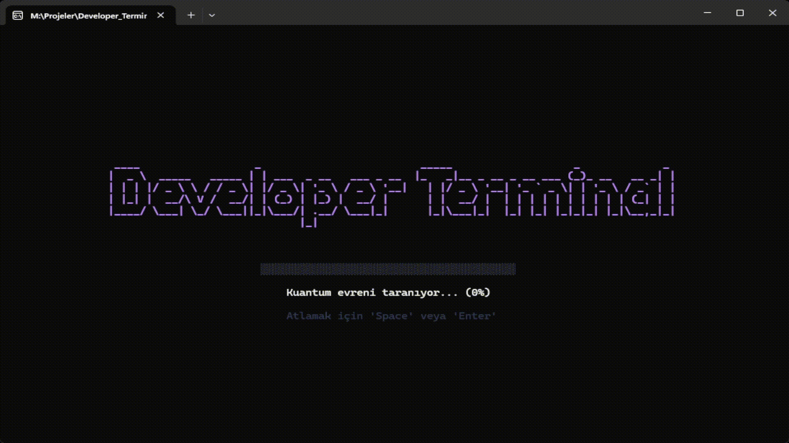
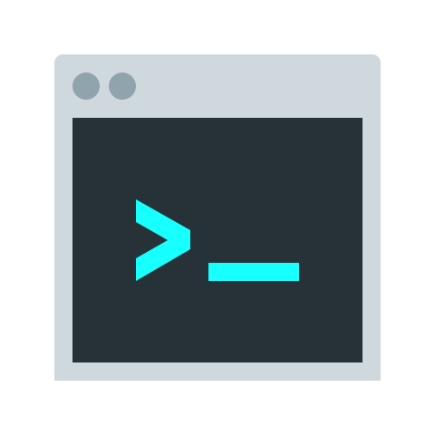
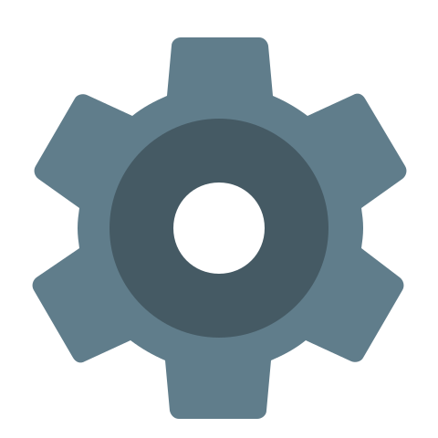

# DEVELOPER TERMINAL //_



<div align="center">

[](https://go.dev/)
[](LICENSE)
[](https://github.com/wmelih001/developer_terminal/releases/latest)
[](http://makeapullrequest.com)

**Eski PowerShell betiklerinizi bir kenara bırakın.**
Modern ve klavye odaklı yeni nesil Geliştirici Kontrol Paneli.

[Özellikler](#-özellikler) • [Kurulum](#-kurulum) • [Yapılandırma](#yapilandirma) • [Teknoloji](#-teknoloji-yığını)

</div>

---

##  Nedir?

**Developer Terminal**, Go ve Bubble Tea ile geliştirilmiş yüksek performanslı bir CLI aracıdır. Geliştirme ortamınızı tek bir merkezden yönetmenizi sağlar; proje başlatmaktan veritabanı araçlarına, port yönetiminden AI bağlamı oluşturmaya kadar her şey parmaklarınızın ucunda.

##  Özellikler

###  Akıllı Proje Başlatıcı
Çalışma alanınızı saniyeler içinde tarar. Tek tuşla projelerinizi Windows Terminal sekmelerinde başlatır.
- **Frontend & Backend Algılama:** `package.json` analizi ile `npm run dev` veya `go run .` gibi komutları otomatik seçer.
- **Full Stack Modu:** Terminali ikiye bölerek hem client hem server'ı aynı anda kaldırır.

###  Script & Task Runner
`scripts` karmaşasına son.
- **Auto-Discovery:** Projenizdeki tüm scriptleri (`dev`, `lint`, `test`) otomatik listeler.
- **Context-Aware:** `framework/client` veya `framework/server` gibi alt dizinlerdeki scriptleri algılar ve doğru dizinde çalıştırır.
- **Hızlı Arama:** `Tab` tuşu ile yüzlerce script arasında anında filtreleme yapın.

###  AI Context Generator
LLM'ler (ChatGPT, Claude) için kod tabanınızı hazırlayın.
- `.gitignore` kurallarına sadık kalarak temiz bir ASCII ağacı oluşturur.
- Çıktıyı anında panoya kopyalar, prompt'unuza yapıştırmaya hazırdır.

###  Proje Sağlık Merkezi
- **Bağımlılık Doktoru:** Güncelliğini yitirmiş paketleri terminalden çıkmadan `npm outdated` analizi ile bulun.
- **Sağlık Skoru:** Projenizi Git durumu, CI/CD, Docker, Linter varlığı gibi kriterlere göre 100 üzerinden puanlar. Eksikleri raporlar.

###  Port & Tünel Yönetimi
- **Port Çakışma Kilidi:** Projeyi başlatmadan önce portun (örn: 3000) dolu olup olmadığını kontrol eder.
- **Ngrok Entegrasyonu:** Tünel durumunu ve public URL'inizi doğrudan panodan izleyin.

###  Gömülü Geliştirici Araçları
Veritabanı ve UI araçlarınıza `F` tuşlarıyla erişin.
| Tuş | Araç | Açıklama |
| :--- | :--- | :--- |
| `F1` | **Prisma Studio** | Veritabanı GUI |
| `F2` | **Drizzle Studio** | Drizzle ORM Yönetimi |
| `F3` | **Hasura Console** | GraphQL Konsolu |
| `F4` | **Supabase** | Yerel Durum Kontrolü |
| `F5` | **Storybook** | UI Bileşen Geliştirme |

##  Kurulum

### Ön Gereksinimler
- **Go** 1.21+
- **Windows Terminal + Powershell 7+** (Önerilen)
- **Nerd Fonts** (İkon desteği için)

### Hızlı Kurulum

```bash
# Projeyi klonlayın
git clone https://github.com/wmelih001/developer_terminal.git

# Dizin değiştirin
cd developer_terminal

# Derleyin ve kurun
go install
```

<a id="yapilandirma"></a>
##  Yapılandırma

İlk çalıştırmada Developer Terminal sizi karşılar ve yapılandırmayı **otomatik** oluşturur.
Manuel düzenleme için `~/.devterminal/config.yaml` dosyasını kullanabilirsiniz.

```yaml
# Örnek config.yaml
projects_paths:
  - M:\Projeler  # Projelerinizin ana dizini

ignored_files:
  - .git
  - node_modules

# Opsiyonel: Ngrok CLI yolu
ngrok_path: C:\Users\Kullanici\AppData\Local\Microsoft\WinGet\Links\ngrok.exe

# Otomatik oluşturulan proje ayarları
project_overrides:
  m:\projeler\developer_terminal:
    frontend: ""
    backend: go run .
  m:\projeler\nextjs-app:
    frontend: npm run dev
    backend: npm run start:dev

# Son açılan projeler (Otomatik güncellenir)
last_opened:
  m:\projeler\developer_terminal: 2026-01-12T22:06:11.3039435+03:00
```

##  Tech Stack

<div align="center">

| Çekirdek | UI / TUI | Yapılandırma |
| :---: | :---: | :---: |
| **Go (Golang)** | **Bubble Tea** & **Lipgloss** | **Viper** |
|  |  |  |

</div>

##  Katkıda Bulunma

Her türlü katkıya açığız! Bir hata bulduysanız veya yeni bir özellik eklemek istiyorsanız lütfen [Issue](https://github.com/wmelih001/developer_terminal/issues) açın veya [Pull Request](https://github.com/wmelih001/developer_terminal/pulls) gönderin.

---

<div align="center">

*Developer Terminal, geliştiriciler tarafından geliştiriciler için yapıldı.* ❤️

</div>
